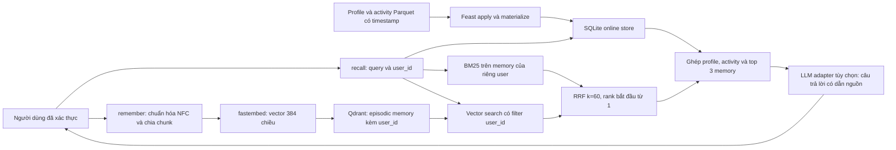

# Hybrid Memory Agent cho người dùng Việt Nam

Người thực hiện: chủ repository DngVinh, với hỗ trợ hiện thực và kiểm chứng của Codex.
Phạm vi: POC chạy cục bộ, Qdrant in-memory, fastembed BGE-small và Feast SQLite.

## Luồng dữ liệu

`recall()` trả context, không gọi LLM trả phí. Profile thật đến từ Feast đã
materialize ở NB4; nội dung đã lưu đến từ Qdrant. Sở thích cloud trong profile
không phải bằng chứng người dùng đã đọc một tài liệu cloud cụ thể.

## Quyết định 1: chunk theo cửa sổ có chồng lấn

Tôi chọn cửa sổ tối đa 160 đơn vị phân cách bằng khoảng trắng, chồng lấn 24
đơn vị, thay vì giữ cả conversation trong một vector. Conversation dài thường
chứa nhiều ý định; vector chung làm loãng một chi tiết Kubernetes giữa các
câu chuyện khác. Cửa sổ ngắn giảm lượng nội dung không liên quan đưa vào context,
giữ được việc truy xuất chi tiết và cho phép dẫn nguồn theo chunk. Chồng lấn
giúp một câu nằm ở ranh giới cửa sổ không bị tách mất hoàn toàn.

Đánh đổi là tăng số vector, lặp văn bản và có thể trả chunk trùng. Semantic
chunking giữ cấu trúc tốt hơn nhưng thêm tokenizer và bước xử lý. POC chọn
cửa sổ đơn giản, lấy ba chunk; production cần khử trùng và kiểm soát context
bằng tokenizer của LLM. Cấu hình này chưa được tối ưu cho production.

Tiếng Việt có nhiều từ nhiều âm tiết được viết cách nhau. Vì vậy tham số 160
được gọi rõ là word-unit budget, không phải 160 token hay 160 từ ngữ nghĩa.
Chuẩn hóa Unicode NFC giúp hai cách mã hóa dấu tiếng Việt không tạo từ vựng
khác nhau. Không bỏ dấu vì việc đó làm mất phân biệt nghĩa. BM25 giữ cả thuật
ngữ tiếng Anh như Kubernetes, OAuth và TLS để hỗ trợ code-switching.

## Quyết định 2: profile dạng bảng, memory dạng vector

Profile dùng entity `user` với join key `user_id`. View
`user_profile_features` chứa tốc độ đọc, ngôn ngữ và topic affinity; TTL 30 ngày,
nguồn Parquet có event timestamp, lịch cập nhật dự kiến hàng ngày. View
`query_velocity_features` chứa số query trong giờ và số topic trong 24 giờ;
TTL một giờ, nguồn activity có timestamp, dự kiến làm mới gần thời gian thực.
View `item_popularity_features` dùng entity `item`, khóa `doc_id`, TTL 24 giờ,
nguồn thống kê tương tác, dự kiến làm mới hàng giờ. NB4 kiểm chứng ba view và
khóa bài viết khớp corpus, dù agent tối thiểu chỉ cần hai view theo user.

Tôi chọn bảng dễ đọc thay vì embedding sở thích: dễ giải thích ngôn ngữ,
tốc độ đọc và sửa từng thuộc tính. Embedding mô tả sở thích phong phú hơn
nhưng khó giải thích, gặp cold start và phải cập nhật khi đổi model. POC
không suy ra thuộc tính nhạy cảm; giá trị thiếu được giữ là thiếu.

Tôi loại bỏ phương án lưu episodic memory trong một feature Feast: lookup
theo khóa không thay thế nearest-neighbor search. Memory và profile có lịch
cập nhật khác nhau. Khi huấn luyện, PIT join lấy snapshot gần nhất không
sau event và trong TTL; latest join kéo thông tin tương lai. NB4 dùng hai
snapshot với tốc độ đọc khác nhau để kiểm chứng điều này.

## Quyết định 3: freshness theo loại dữ liệu

Một ghi chú người dùng vừa lưu cần xuất hiện ngay trong lần recall tiếp theo.
`remember()` embed và upsert với `wait=True` trước khi trả về. Đây là bảo đảm
read-after-write đồng bộ trong POC, không phải cam kết sub-second: embedding
trên CPU có thể mất lâu hơn tùy độ dài. Production có thể dùng hàng đợi và
trả trạng thái pending, nhưng cần cho người dùng biết khi memory chưa sẵn sàng.

Phát hiện bất thường cần streaming hoặc Feast Push API. Gợi ý bài đọc có thể
chấp nhận batch năm phút để giảm độ phức tạp. Profile có thể cập nhật hàng
ngày; TTL không phải lịch refresh. POC dùng activity materialize từ NB4,
chưa hiện thực streaming. Memory mới không tự tăng `queries_last_hour`.

## Retrieval, cô lập và giới hạn

BM25 chạy trên memory của đúng user, vector search cũng filter `user_id`
trước khi xếp hạng. RRF cộng `1/(60+rank)` với rank bắt đầu từ 1, không cộng
điểm BM25 với cosine trực tiếp. Ngôn ngữ ưu tiên và topic affinity được đưa
vào context để LLM dùng khi diễn giải, không ép filter topic làm mất các
memory ngoài sở thích. Đây là bài học từ NB6: filter suy đoán có thể giảm recall.

Demo kiểm tra cô lập user và trường hợp chưa có memory. Production phải xác
thực user từ phiên đăng nhập, xem memory là dữ liệu không đáng tin. POC chưa
có persistence, mã hóa lưu trữ, đồng bộ thiết bị hay xóa memory. BGE-small
chủ yếu tiếng Anh; phải đo tiếng Việt trước khi đổi model. Demo không chứng
minh SLA production.

## Chạy lại

Chạy setup Lite, NB4, rồi `python bonus/demo.py` bằng Python trong `.venv`.
Script in đủ năm query yêu cầu và kiểm tra cô lập user. Kết quả được lưu
cùng bằng chứng nộp bài.
